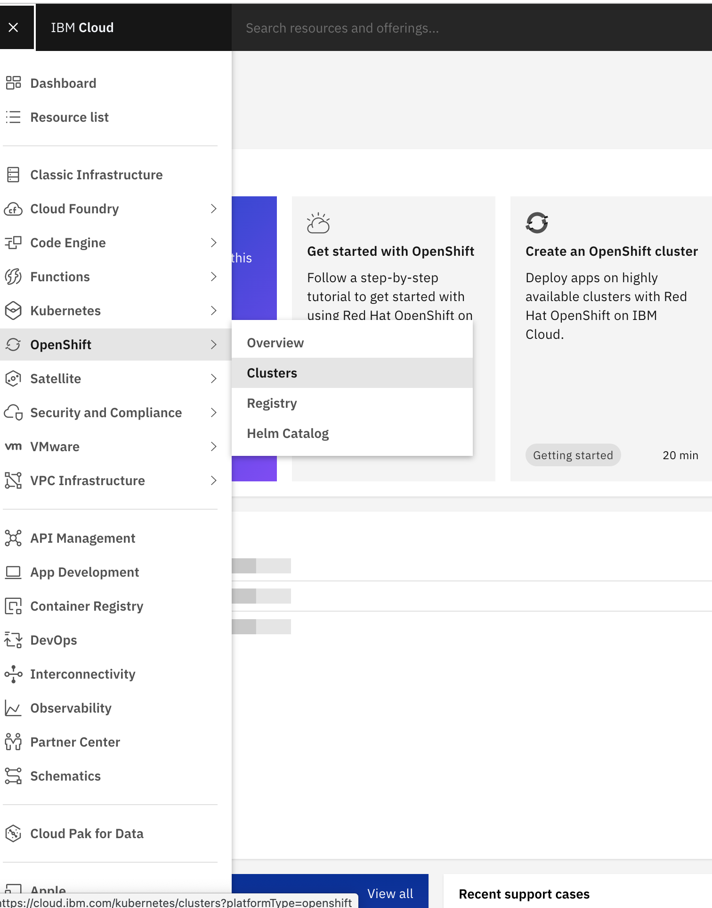
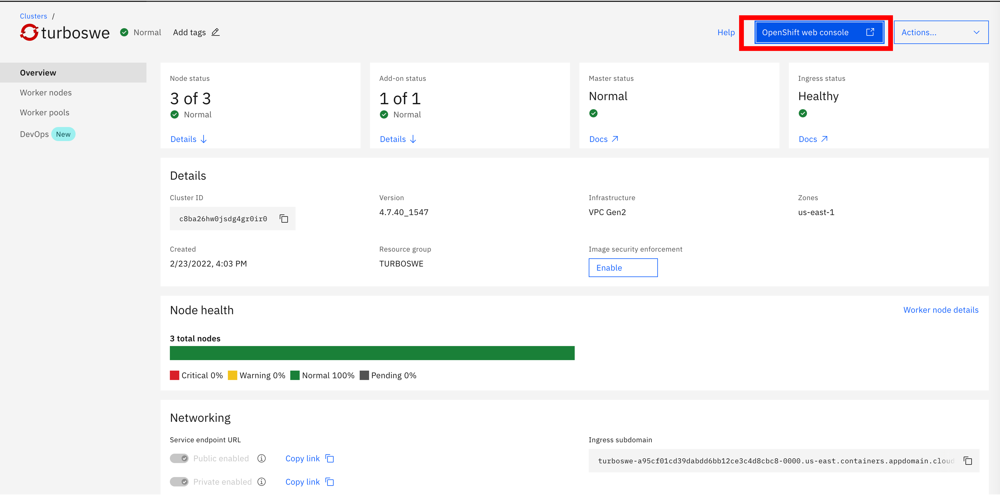
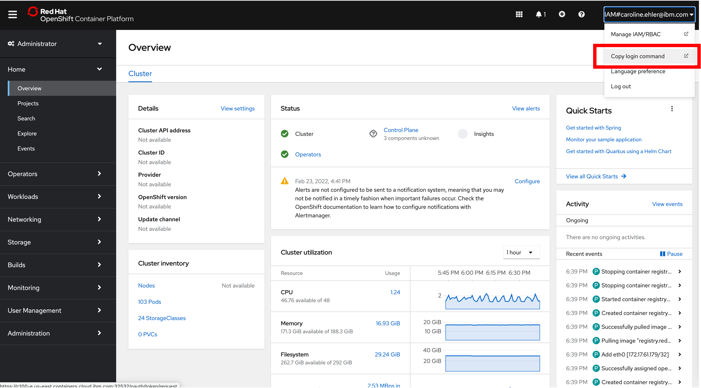
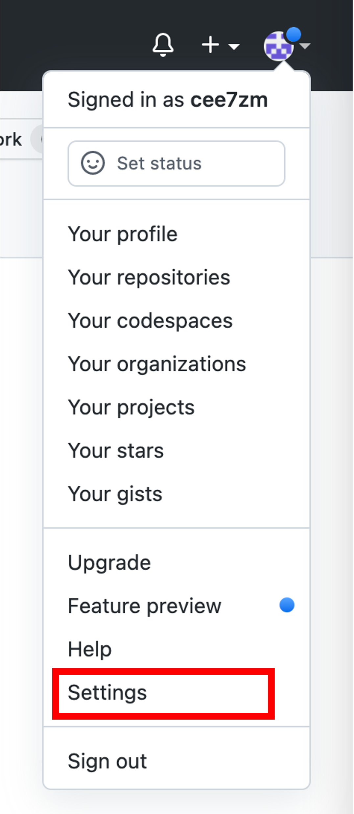
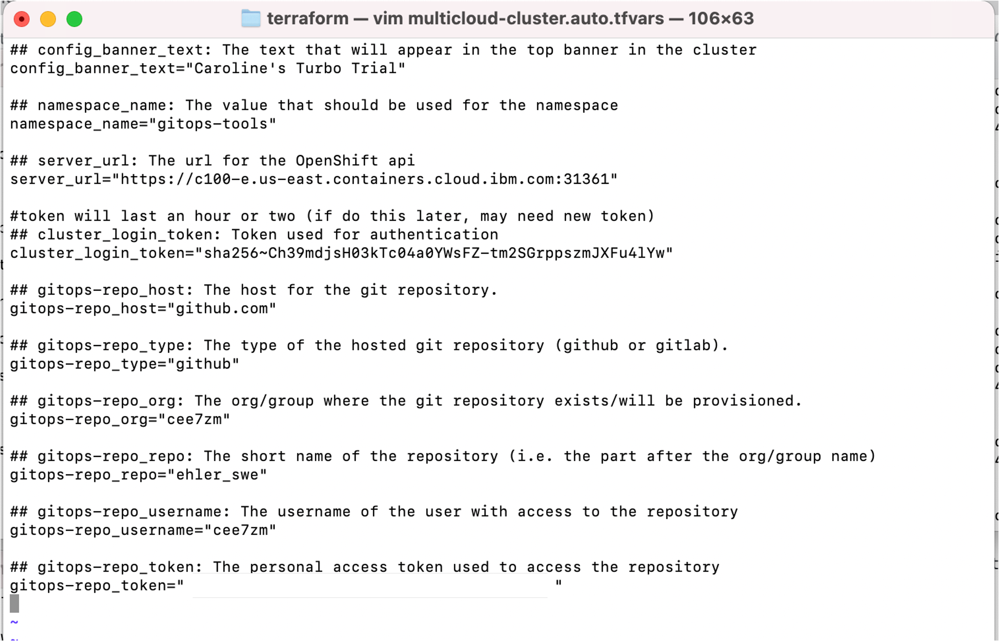

# Software Everywhere Turbonomics BEGINNER Tutorial


Hello! Welcome to Caroline Ehler's documentation/tutorial I've compiled for the Software Everywhere project!
This tutorial is specific to Turbonomic.

## Tutorial
### Set-Up
To begin, you'll need to be sure to have all of these things installed on your machine: Docker & Node.js

If you don't, follow these steps:

A. Download Homebrew: https://sourabhbajaj.com/mac-setup/Homebrew/
Follow the Homebrew setup tutorial.

B. Download Homebrew's Node.js: https://sourabhbajaj.com/mac-setup/Node.js/

C. Download Homebrew's Docker: https://sourabhbajaj.com/mac-setup/Docker/
BUT I find this tutorial a little confusing. Here is what to do:
```bash
brew install cask
brew install --cask docker
```

D. If you don't have an IDE, I'm going to be using VS Code, so be sure to download that too.

### Begin Tutorial
1. Create a cluster on Red Hat Openshift using IBM Cloud. https://cloud.ibm.com/ 



2. Clone the Iascable Repo here: https://github.com/cloud-native-toolkit/iascable
```bash
git clone https://github.com/cloud-native-toolkit/iascable.git
```

3. Inside the Iascable directory, install node.js
```bash 
npm install
```

4. Create a Bill of Materials (BOM) called ```gitopsbootstrap-bom.yaml``` in Iascalbe.

```python
apiVersion: cloud.ibm.com/v1alpha1
kind: BillOfMaterial
metadata:
  name: multicloud-cluster
spec:
  modules:
    - name: ocp-login
    - name: olm
    - name: gitops-namespace
    - name: argocd-bootstrap
    - name: gitops-console-link-job
    - name: gitops-cluster-config
      alias: config
      variables:
        - name: banner_text
          important: true
  ```
  5. Run the BOM to generate the terraform file: 
  ./iascable build -i <location_of_gitopsbootstrap-bom.yaml_file> -o <location_for_output>
```bash 
./iascable build -i gitopsbootstrap-bom.yaml -o ./myFolder
```
6. Accessing the generated folder from the above command, cd into myFolder --> multicloud-cluster --> terraform

7. Edit the file ```multicloud-cluster.auto.tfvars``` Uncomment the last line of each section to add your modifications. 

7a. Banner Text: The title of the top banner in the cluster
```config_banner_text="Turbonomics Tutorial"```

7b. Namespace Name = The value that should be used for the namespace
```namespace_name="gitops-tools"```

7c. Server URL: The url for the OpenShift api
```server_url="https://c100-e.us-east.containers.cloud.ibm.com:31361"```

To access this, go to the OpenShift console from your cluster. 



Click the dropdown from your username.



Click "Copy login command".

Hit display token.

Use the URL that follows ```--server=``` from the Login with this Token ```oc login``` line.

7d. Cluster Login Token:

```cluster_login_token="sha256....."```

Following the same steps as above for the Server URL, go to the same page with your OpenShift token login. 

Use the API token as the Cluster Login Token.

7e. Gitops-repo_host: The host for the git repository. (Use github.com)

```gitops-repo_host="github.com"```

7f. Gitops-repo_type: The type of the hosted git repository (github or gitlab).

```gitops-repo_type="github"```

7g. Gitops-repo_org: The org/group where the git repository exists/will be provisioned. (Your Github username)

```gitops-repo_org="cee7zm"```

7h. Gitops-repo_repo: The short name of the repository (i.e. the part after the org/group name) (The name for the repo the terraform will generate. Be sure the name you choose is not one of your existing repositories already).

```gitops-repo_repo="my_turbo_repo"```

7i. Fitops-repo_username: The username of the user with access to the repository (your github username)

```gitops-repo_username="cee7zm"```

7j. Gitops-repo_token: The personal access token used to access the repository

```gitops-repo_token="...[your generated token]..."```

To access your github generated token, go to Github.com.

Login, and select your profile menu. 



Go to Settings --> Developer Settings (bottom of left-side menu list) --> Personal Access Tokens (again, bottom of left-side menu)

Generate a new token. MAKE NOTE OF THIS TOKEN. IT WILL DISAPPEAR AFTER YOU VIEW IT.

Select the permissions for the token to be at least the bolded repo and delete_repo boxes. 

Hit Generate Token. MAKE NOTE OF THIS TOKEN. Hit the copy button and store it somewhere for future reference.




8. oc login line 


4. Download this Bill of Materials (BOM1): https://github.com/cloud-native-toolkit/automation-solutions/blob/main/boms/turbonomic/turbo-gitops-bom.yaml 
5. go to iascable directory
6. Build Turbonomics Bill of Materials (BOM) with iascable tool
```bash 
./iascable build -i <location of BOM1 yaml> -o <location for output>
```
Note: the location should be a path
6. Within the location of output from above, edit the resulting tfvars file with your environment info for your cluster
7. Set your ibmapikey first
8. Run the automation with a docker terraform container 
```bash
docker run -it -e TF_VAR_ibmcloud_api_key=$APIKEY -e IBMCLOUD_API_KEY=$APIKEY -v ${PWD}:/terraform -w /terraform quay.io/ibmgaragecloud/cli-tools:v0.15
```


/*
5.  Pull this file down: https://github.com/cloud-native-toolkit/automation-solutions/blob/main/boms/turbonomic/turbo-gitops-bom.yaml 
6. 
4. Create a Bill of Materials (BOM) called ```gitopsbootstrap-bom.yaml``` ?where?

```python
apiVersion: cloud.ibm.com/v1alpha1
kind: BillOfMaterial
metadata:
  name: multicloud-cluster
spec:
  modules:
    - name: ocp-login
    - name: olm
    - name: gitops-namespace
    - name: argocd-bootstrap
    - name: gitops-console-link-job
    - name: gitops-cluster-config
      alias: config
      variables:
        - name: banner_text
          important: true
  ```
  */
## Contributing


